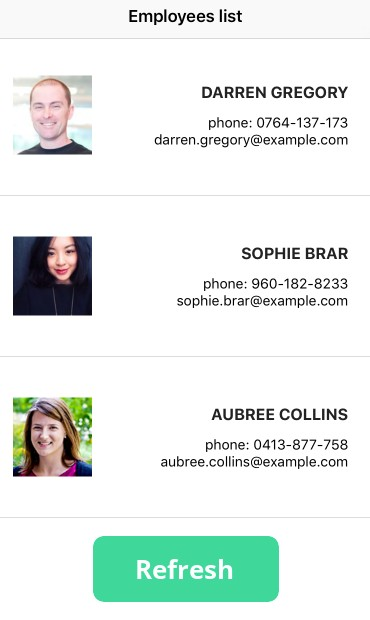

# CS445 - fetch

Today's lab is used to practice using `fetch` to get data from sever side. Since we haven't learnt how to create server side, we choose [Random User APIs](https://randomuser.me/documentation#howto) which is a free and easy to use service to generate random user data for application testing. 

Read [Random User APIs](https://randomuser.me/documentation#howto), then create a html page which displays a list of 5 employees. On the same page, there's a `Refresh` button, when click the button, new 5 employees will be fetched/displayed without loading the entire page.

The below is an example of the appearance of the html page. You don't need to have the same style. The importance is the feature.

