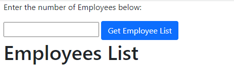
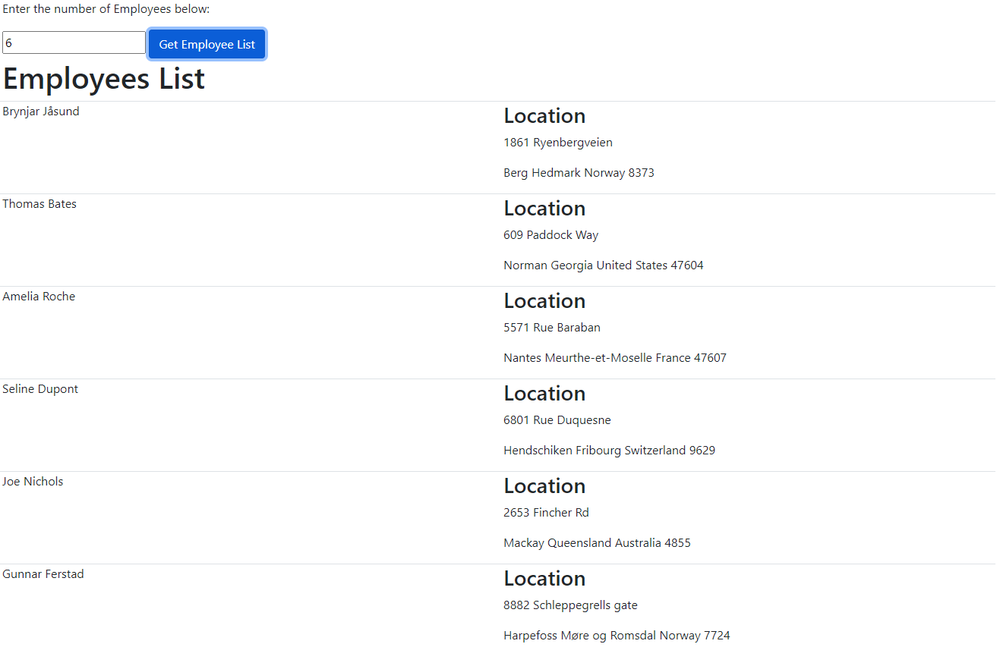

# CS445 - RXJS

Today's lab is used to practice using `Observables` to get data from sever side. Since we haven't learnt how to create server side, we choose [Random User APIs](https://randomuser.me/documentation#howto) which is a free and easy to use service to generate random user data for application testing. 

Read [Random User APIs](https://randomuser.me/documentation#howto), then create a html page to display employees.

**Here is the difference from yesterday's lab**

1. MUST use `Observables`
2. Provide an input for users to fetch specific number of employees they want
3. Display employees' full name and location/address on the page

The below is an example of the appearance of the html page. You don't need to have the same style. The importance is the feature.

## Screenshot 1

## Screenshot 2

